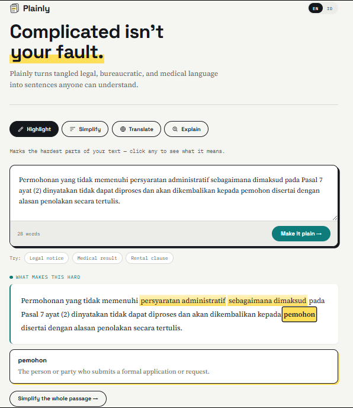

# Plainly

**A comprehension layer for complicated language.**

Plainly helps people understand legal, bureaucratic, and medical documents —
without rewriting the meaning out of them.

[**Live demo**](https://plainly-sepia.vercel.app) · Built for the NeuralSprint
hackathon



---

## The problem

Every day people receive documents that decide something about their lives — a
rejection letter, a lease clause, a lab result, a court notice. The information
is public and legally theirs. The language is not.

So people sign things they don't understand, miss deadlines they didn't see, and
walk away from processes they were entitled to complete. The barrier isn't
literacy. It's jargon.

## Why Plainly works differently

Most AI writing tools take your document and hand you a different one. That's
fine for a blog post. It's dangerous for a legal notice — a "simpler" version
that quietly drops a deadline or softens an obligation is worse than no help at
all.

Plainly's starting point is the opposite:

> **Keep the original document intact. Help the reader meet it where it's hard.**

That single decision shaped everything else in the product.

## Four ways to understand a document

| Mode | What it does |
|---|---|
| **Highlight** | Marks the 3–6 hardest phrases in your text — jargon, acronyms, institutional abbreviations. Your document is not rewritten. Click any mark for a plain explanation. |
| **Simplify** | Rewrites the whole passage in everyday language, with strict rules about what must survive unchanged. |
| **Translate** | Ten languages, translated into natural plain language rather than literal equivalents. |
| **Explain** | Unpacks the jargon and gives a one-line summary of what the passage actually says. |

## The interface language is a signal, not decoration

The EN / ID toggle doesn't just relabel buttons. It tells Plainly which language
the reader actually understands, and every answer follows it.

An expatriate in Indonesia can set the interface to English, paste an Indonesian
government letter, and get English explanations of Indonesian terms. The
highlighted phrases stay in the original — they have to, they're the reader's own
document — but everything Plainly says *about* them arrives in the reader's
language.

## Engineering decisions

**AI calls happen server-side.**
The browser sends only `mode`, `level`, `lang`, `text`, and `uiLang`. Prompts are
built on the server and the API key never reaches the client. A user can't
substitute their own system prompt by editing a request.

**The server decides where highlights go, not the model.**
The model proposes phrases; the server searches the original text for each one
and computes the position itself. A phrase the model invented or altered simply
gets dropped. Overlapping ranges are rejected. The original text is never
adjusted to accommodate the model.

**Simplification has explicit preservation rules.**
The prompt requires every number, date, deadline, obligation, prohibition,
condition, and named entity to survive exactly as written — and requires
ambiguity in the source to stay ambiguous rather than being resolved by guess.

**Explanations are grounded.**
Explain mode is instructed never to add facts the document doesn't contain, and
never to change how certain something is. An allegation stays an allegation.

**Pasted text is cleaned before processing.**
Real users copy whole web pages. Plainly strips duplicated captions, sponsor
markers, and navigation leftovers before anything is sent to the model — and
tells the reader how much was removed.

**Model fallback and quota-aware retries.**
Transient 503s are retried with backoff. Daily quota exhaustion is detected
separately and fails over to the next model in the chain instead of retrying
pointlessly.

**No database.**
Nothing is stored, so there's nothing to leak. An MVP that processes documents
people consider private is better off holding none of them.

## Tech stack

- **Framework:** Next.js 14 (App Router), React 18
- **AI:** Google Gemini
- **Styling:** hand-written CSS, no UI framework
- **Hosting:** Vercel
- **Dependencies beyond Next and React:** none

## Limitations

Plainly uses generative AI and can produce explanations that are wrong or
overconfident. It is a comprehension aid, not a substitute for a lawyer, doctor,
or official interpretation.

Known gaps in this MVP:

- Instructions embedded in a pasted document are handled with prompt guarding,
  but prompt injection through document content is not fully solved.
- Rate limiting is in-memory and per-instance, which slows casual abuse but is
  not a substitute for a shared store.
- No PDF or scanned-document input yet — text must be pasted.
- No automated test suite.

## Running locally

```bash
npm install
cp .env.local.example .env.local     # Windows: copy .env.local.example .env.local
```

Create an API key at [Google AI Studio](https://aistudio.google.com/apikey) and
put it in `.env.local` as `GEMINI_API_KEY`, then:

```bash
npm run dev
```

Open http://localhost:3000.

Never commit `.env.local` — it's already in `.gitignore`.

## Deploying

Push to GitHub, import the repository at [vercel.com](https://vercel.com), and
add `GEMINI_API_KEY` under **Environment Variables** before deploying. Changing
an environment variable later requires a redeploy to take effect.

## Project structure

```
app/
  page.js                  interface, highlight rendering, paste cleanup
  globals.css              design system
  layout.js                fonts and metadata
  api/plainly/route.js     prompts, validation, rate limiting, model fallback
```

## What's next

- Structured document input (PDF, images with OCR)
- Side-by-side original and simplified view
- Saved glossaries for recurring institutional jargon

## License

MIT
